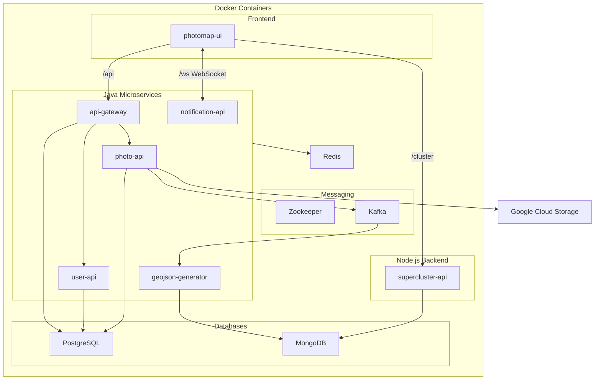

# СтаріФото.Укр

<div align="center">


👋 Old photos platform

**URL:** [https://starifoto.in.ua](https://starifoto.in.ua/), or [https://старіфото.укр](https://старіфото.укр)

</div>

## 🌟 Features

The application enables users to explore old historical photos of Ukraine on an interactive map interface.

### For Anonymous Users:
- [View map of Ukraine](docs/features.md#map-view) with geolocated old photos (grouped in clusters)
- [Filter photos](docs/features.md#photo-filtering) using tags search and/or year range
- [View photo galleries](docs/features.md#photo-gallery) for clusters
- [View colorized versions](docs/features.md#colorized-photos) of photos (when available)
- [Access detailed photo information](docs/features.md#photo-details) (title, description, years, tags, author)
- [View user profiles](docs/features.md#user-profiles) and their uploaded photos
- Sign in via Google or email/password

### For Logged-in Users:
- All anonymous user features
- [Add new photos](docs/features.md#photo-upload) to the map
- Edit and delete own photos
- [Comment on photos](docs/features.md#comments) of other users

### For Moderators/Admins:
- All logged-in user features
- Edit and delete other users' photos
- Manage users (deactivate profiles and change roles)

For detailed feature list with screenshots:
- [📷 View local screenshot documentation](docs/features.md)

## 🏗️ Architecture

The application follows a microservices architecture with the following components:



### Key Technologies

- **Backend:**
  - Java (Spring Boot 3) microservices
  - Node.js for map clustering
- **Frontend:**
  - Vue 3 + Nuxt 3 with SSR (Server-Side Rendering)
  - Pinia for state management
  - [MapLibre](https://maplibre.org/) for map integration
- **Database:**
  - PostgreSQL for user & photo related data
  - MongoDB for GeoJSON data displayed on the map
- **File Storage:**
  - Google Cloud Storage for image files
- **Authentication:**
  - [JWT](docs/jwt.md)
  - Google OAuth 2.0
- **Messaging:**
  - [Kafka](docs/kafka.md) for triggering GeoJSON regeneration in MongoDB when photos are updated
  - Zookeeper for Kafka coordination
- **Caching:**
  - [Redis](docs/redis.md) for caching and broadcasting notifications across server instances
- **Real-Time Communication:**
  - [WebSockets](docs/websockets.md) for notifications

### Components

#### Frontend
- **photomap-ui**: Vue 3 and Nuxt 3 based frontend application

#### Backend Services
- **api-gateway**: Main API gateway for HTTP requests
- **photo-api**: Service for photo management
- **user-api**: User management service
- **notification-api**: WebSocket-based and email notification service
- **geojson-generator**: Service for generating GeoJSON data
- **supercluster-api**: Node.js service for map clustering using supercluster library

#### Databases
- **PostgreSQL**: Primary database for user and photo metadata, including:
  - User profiles and authentication
  - Photo metadata (title, description, years, location)
  - Tags
  - Comments
  - Licenses
  - User roles and permissions
- **MongoDB**: Database for GeoJSON data displayed on the map
- **Redis**:
  - Caching for Java microservices
  - Redisson Pub/Sub for WebSocket notifications across all backend pods

#### Message Queue
- **Kafka**: Message broker for triggering GeoJSON regeneration in MongoDB when photos are updated
- **Zookeeper**: Coordination service for Kafka

#### Storage
- **Google Cloud Storage**: Cloud storage for image files

### Communication Flow

The application uses a combination of HTTP, WebSocket, and event-driven communication patterns. Key aspects include:
- API Gateway for request routing and authentication
- Kafka for asynchronous event processing
- WebSockets for client-server communication
- Redis Pub/Sub for broadcasting notifications across all service instances (ensures notifications reach all clients even with multiple pods)

For detailed communication flows, see [Backend Architecture](docs/backend.md#-communication-flow).

## 📚 Documentation

For more detailed information about the application, please refer to the following documentation files:

- [Features](docs/features.md): Comprehensive list of application features with screenshots.
- [Backend](docs/backend.md): Detailed description of backend services and components.
- [Frontend](docs/frontend.md): Overview of the frontend architecture and technologies.
- [Map Integration](docs/map-integration.md): Details on map libraries and geocoding.
- [JWT Authentication](docs/jwt.md): Overview of the JWT authentication mechanism used in the project.
- [WebSockets](docs/websockets.md): Details on WebSocket connections and message routing.
- [Redis](docs/redis.md): Information on Redis caching and Pub/Sub usage.
- [Kafka](docs/kafka.md): Explanation of Kafka's role in the application.

## Directory Structure

```
starifoto/
|
├── docs/                             # Project documentation and guides
├── k8s/                              # Kubernetes deployment configurations
├── photomap-core-api/                # Java Backend core services
│   ├── api-gateway/                  # API Gateway service for routing and authentication
│   ├── docker/                       # Docker configurations for core services
│   ├── geojson-generator/            # Service for generating GeoJSON data from photos
│   ├── notification-api/             # Service handling user WebSocket and email notifications
│   ├── photo-api/                    # Core service for photo management and processing
│   ├── photomap-common/              # Shared utilities and common code
│   └── user-api/                     # User management and authentication service
├── photomap-supercluster-api/        # Node.js map clustering service for efficient photo display
│   ├── docker/                       # Docker configurations
├── photomap-ui/                      # Frontend Vue 3 application for photo map interface
│   ├── docker/                       # Docker configurations
```

---
<div align="center">
Made with ❤️ for Ukraine 🇺🇦
</div>