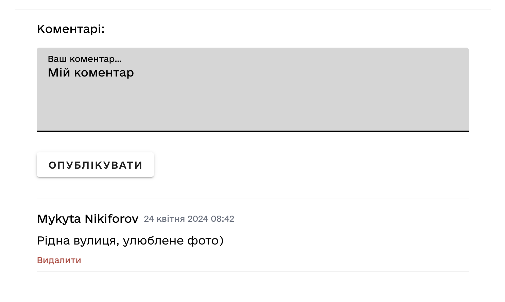

# StariFoto Features

This document shows the main features of the StariFoto application with screenshots.

## Map View

The map view displays historical photos clustered by location, allowing users to explore Ukraine's visual history geographically.

## Photo Filtering

Users can filter photos by:
- Time period (year range)
- Tags/categories
- Location

## Photo Gallery

When selecting a cluster, users can browse through all photos in that location in a gallery view.

## Colorized Photos

The application supports viewing both original black and white photos and their colorized versions when available.

## Photo Details

Each photo includes detailed information:
- Title and description
- Date/time period
- Location details
- Author information
- Tags/categories
- License information

## User Profiles

User profiles display:
- User information
- Contributed photos
- Activity history

## Photo Upload

Logged-in users can upload new historical photos:
1. Upload image file
2. Add metadata (title, description, date)
3. Place on map
4. Add tags
5. Set license information

## Comments

Users can comment on photos to provide additional context, correct information, or engage in discussions about the historical content. 