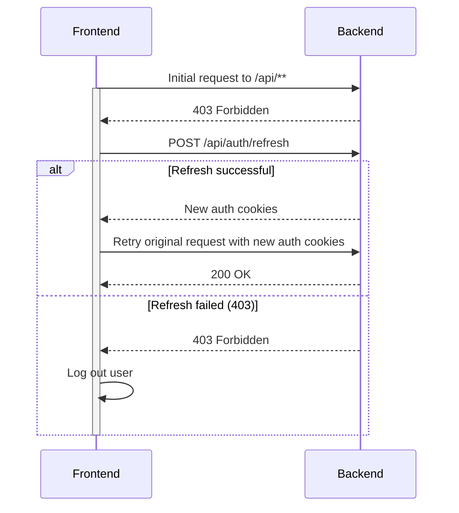

# 🔐 JWT Authentication

This document provides an overview of the JWT (JSON Web Token) authentication mechanism used in the StariFoto project.

## 📜 Overview

JWT is used for user authentication. Once obtained, the token is passed as a request cookie to authenticate subsequent requests.

## 🔑 Obtaining a Token

To obtain an access token, users must either log in or refresh their token.

### Login Endpoints

#### POST /api/auth/login
- **Description**: Used to log in with email and password.
- **Request Body**:
  ```json
  {
    "email": "email@gmail.com",
    "password": "base64encoded"
  }
  ```

#### POST /api/auth/google
- **Description**: Used to log in with Google credentials.
- **Request Body**:
  ```json
  {
    "credential": "google-credential-token"
  }
  ```

### Refresh Token

#### POST /api/auth/refresh
- **Description**: Used to refresh the access token.
- **Authentication**: The request should contain a `refreshToken` cookie or an `Authorization` header with the value `Bearer ${refreshToken}`.

### Response

- **Cookies**: The response includes `accessToken` and `refreshToken` cookies.
- **Response Body**:
  ```json
  {
    "user": {
      // user data
    },
    "accessToken": "accessTokenValue",
    "expiresIn": 86399394,
    "refreshToken": "refreshTokenValue",
    "refreshTokenExpiresIn": 604799394
  }
  ```

## 🔄 Using the Token

1. Once obtained, the token is sent as a cookie with each request.
2. The [api-gateway](backend.md#api-gateway) microservice has an AuthenticationFilter that verifies:
   - The validity of the JWT token.
   - The user's active status.
   - If the token is invalid, a 403 Forbidden response is returned.

### Refresh Flow

- If the frontend client receives a 403 response code, it attempts to refresh the token.
- If the token is successfully refreshed, the original request is retried with the new authentication cookies.
- If the refresh fails (403 response code), the user is logged out.

## 🔄 Refresh Token Process



---

Made with ❤️ for Ukraine 🇺🇦 